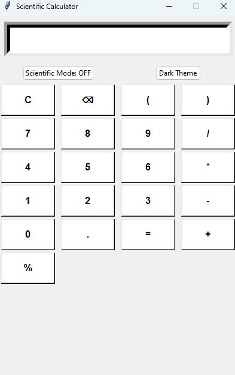
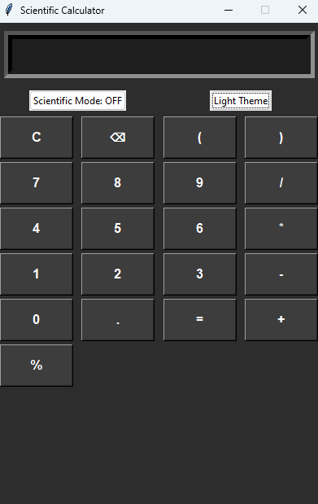
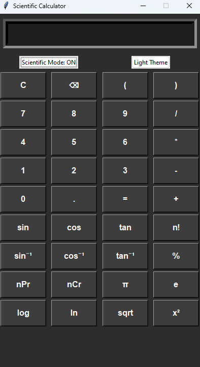

# Scientific Calculator

A modern scientific calculator built with Python and tkinter, featuring both normal and scientific modes, along with theme switching capabilities.

## Quick Start

### Windows Users
1. Download the `Scientific Calculator.exe` from the `dist` folder
2. Double-click to run the calculator
3. No installation required!

### Python Users
If you want to run from source:
1. Make sure you have Python 3.x installed
2. Install required packages:
   ```
   pip install -r requirements.txt
   ```
3. Run the calculator:
   ```
   python scientific_calculator.py
   ```

## Screenshots

### Normal Calculator - Light Theme


### Normal Calculator - Dark Theme


### Scientific Calculator - Dark Theme


## Features

1. Two Operation Modes:
   - **Normal Mode**: Basic arithmetic operations
     * Addition (+), Subtraction (-), Multiplication (*), Division (/)
     * Percentage calculations
     * Parentheses for complex expressions
   
   - **Scientific Mode**: Advanced mathematical operations
     * Trigonometric functions (sin, cos, tan)
     * Inverse trigonometric functions (sin⁻¹, cos⁻¹, tan⁻¹)
     * Logarithmic functions (log, ln)
     * Powers (x²)
     * Square root (sqrt)
     * Constants (π, e)
     * Factorial (n!)
     * Permutation (nPr)
     * Combination (nCr)

2. Theme Options:
   - Light Theme (Default)
   - Dark Theme
   - Easy theme switching with a dedicated button

3. Special Features:
   - Clear (C) button to reset calculations
   - Backspace (⌫) button to delete last entry
   - 3D Button Effects
   - User-friendly Interface

## Requirements

- Python 3.x
- tkinter (usually comes with Python installation)

## How to Run

1. Make sure you have Python installed on your system
2. Navigate to the project directory
3. Run the calculator:
   ```
   python scientific_calculator.py
   ```

## Usage Guide

### Basic Operations
- Enter numbers using the numeric keypad
- Use operators (+, -, *, /) for basic arithmetic
- Press '=' to calculate
- Use 'C' to clear all
- Use '⌫' to delete last entry

### Percentage Calculations
To calculate percentage (e.g., 5% of 13):
1. Enter the percentage (e.g., 5)
2. Press '%'
3. Press '*'
4. Enter the number (e.g., 13)
5. Press '=' to get result (0.65)

### Factorial Calculations
To calculate factorial (e.g., 5!):
1. Enter the number (e.g., 5)
2. Press 'n!' button
3. Result appears immediately

### Trigonometric Functions
To calculate sin, cos, tan (in degrees):
1. Press the function button (sin, cos, or tan)
2. Enter the angle in degrees
3. Press ')'
4. Press '=' to calculate

### Inverse Trigonometric Functions
To calculate sin⁻¹, cos⁻¹, tan⁻¹:
1. Press the inverse function button (sin⁻¹, cos⁻¹, or tan⁻¹)
2. Enter the value
3. Press ')'
4. Press '=' to calculate

### Permutation and Combination
To calculate nPr or nCr:
1. Enter first number (n)
2. Press 'nPr' or 'nCr'
3. Enter second number (r)
4. Press '=' to calculate

### Theme Switching
- Click the theme button to toggle between light and dark themes
- Theme changes take effect immediately

## Limitations
- Factorial calculations are limited to numbers ≤ 100
- Permutation and Combination calculations are limited to numbers ≤ 100
- Scientific notation is used for very large numbers
